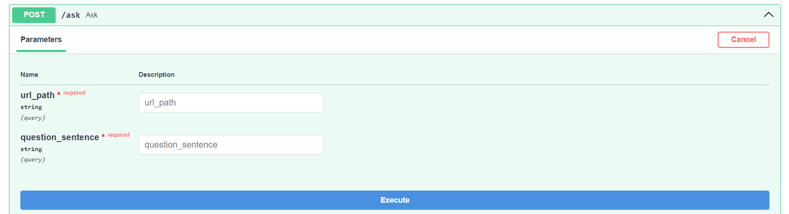

# Develop a chatbot to answer user questions about the website’s information
## Introduction
This project is to use RAG technique to augment LLM (GPT-3.5) with additional data, store data in a vector database (Chroma) to retrieve, apply langchain framework to build this RAG application (chatbot). This is deployed with FastAPI and Docker.

## Installation
'''
pip install -r requirements.txt

'''
## Run
### Solution 1:
'''
uvicorn main:app --reload

'''
- "main:app" is a application in main.py with app function
- "--reload" is an optional, will restart automatically when detecting the change in source
- After run the above command: go to "http://127.0.0.1:8000/docs" to use the app \\

- Fill in the "url_path" you want to extract information.
- Fill in the "question_sentence" you want to ask.
- Finally, click "Execute" then get the result.
### Solution 2:
'''
docker compose up --build

'''
- After run the above command, do the same as the remaining steps in Solution 1